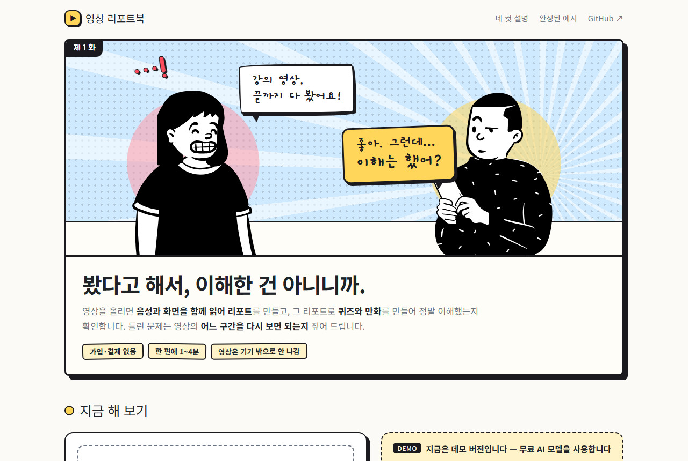
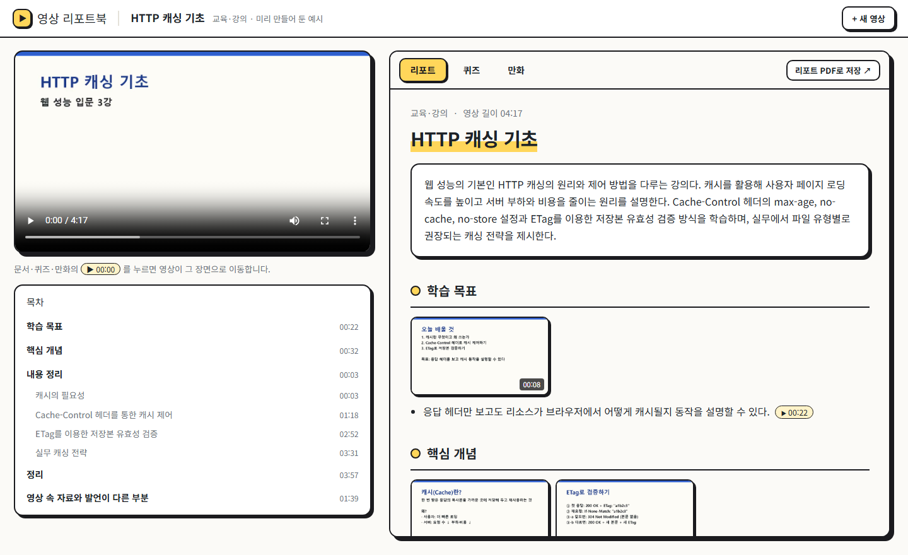
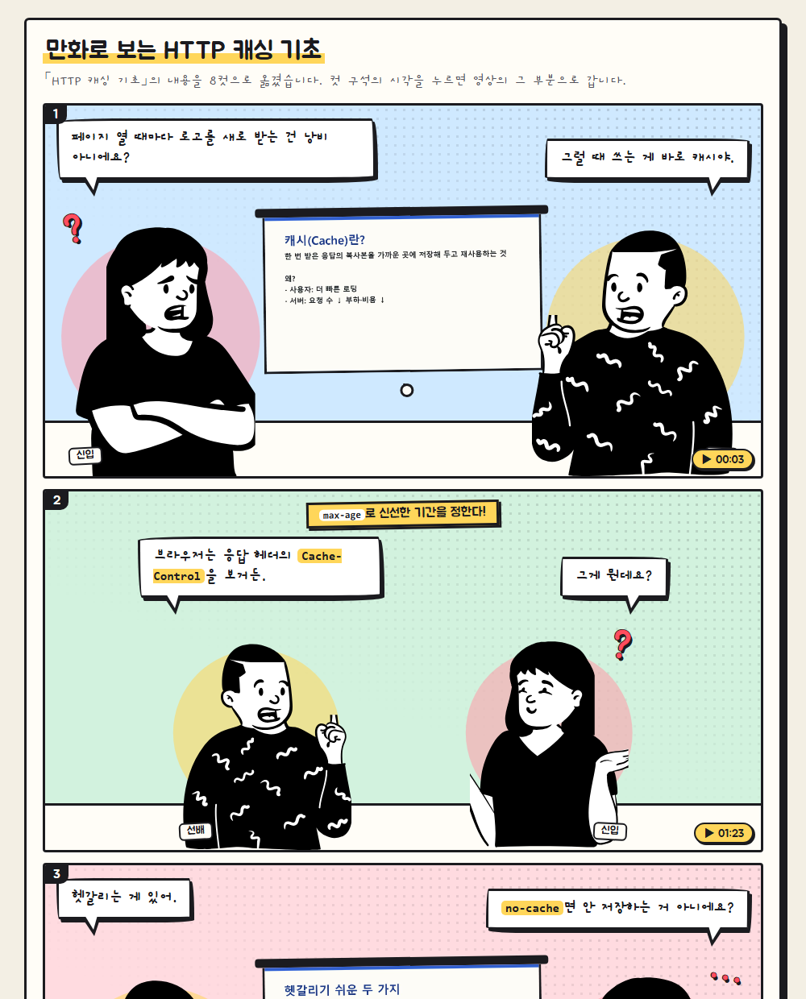
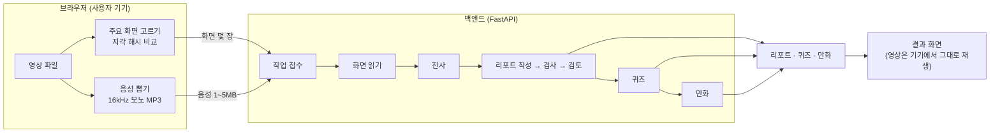

# 영상 리포트북

> **봤다고 해서, 이해한 건 아니니까.**
> 영상을 올리면 음성과 화면을 함께 읽어 **리포트**를 만들고, 그 리포트로 **퀴즈**와 **만화**를 만들어 정말 이해했는지 확인합니다.

**[▶ 서비스 열기](https://jeongwoobin335.github.io/video-report-book/)** · **[기다리지 않고 완성된 예시 보기](https://jeongwoobin335.github.io/video-report-book/web/#demo)**

[](https://jeongwoobin335.github.io/video-report-book/)

강의·교육·회의 영상은 "봤다"로 끝나기 쉽습니다. 요약을 만들어 주는 도구는 많지만, **보는 사람이 실제로 이해했는지**는 아무도 확인해 주지 않습니다. 영상 리포트북은 요약에서 멈추지 않고, 그 요약으로 문제를 내고, 틀리면 **영상의 어느 구간을 다시 보면 되는지**를 짚어 줍니다.

- 가입·결제·API 키 입력 없이 바로 씁니다.
- **영상 파일은 기기 밖으로 나가지 않습니다.** 브라우저가 음성과 주요 화면 몇 장만 뽑아 보냅니다.
- 영상 한 편에 1~4분.

## 결과물

[](https://jeongwoobin335.github.io/video-report-book/web/#demo)

| | 무엇이 다른가 |
|---|---|
| **리포트** | 모든 문장에 영상의 시각(`▶ 01:58`)이 붙고, 누르면 그 장면으로 갑니다. **슬라이드와 말이 서로 다르면** 어느 한쪽으로 정리하지 않고 "영상 속 자료와 발언이 다른 부분"에 따로 모읍니다. 화면에만 있고 말로는 설명하지 않은 내용은 `슬라이드에만 있음`으로 표시합니다. PDF로 저장할 수 있습니다. |
| **퀴즈** | 영상에 실제로 나온 내용으로만 출제합니다. 자료와 발언이 어긋난 값, 한 번만 들려 불확실한 숫자는 **스크립트가 출제를 막습니다.** 채점 뒤에는 점수보다 "이 구간(총 01:09)만 다시 보세요"를 먼저 보여 줍니다. 정답은 서버에만 있고 브라우저로 내려오지 않습니다. 회의 영상은 점수 대신 "다시 확인하실 부분 N곳"만 알려 주고 사람을 가려내지 않습니다. |
| **만화** | 핵심을 선배와 신입의 대화 8컷으로 옮깁니다. 영상의 실제 슬라이드가 컷 안의 스크린에 나오고, 컷마다 영상 시각이 달려 있습니다. |

<p align="center"><a href="https://jeongwoobin335.github.io/video-report-book/web/#demo"></a></p>

## 어떻게 동작하나



1. **브라우저**가 영상에서 음성(Web Audio + lamejs)과 장면이 바뀌는 화면(`<video>` + 캔버스, 지각 해시)만 뽑습니다. ffmpeg.wasm 없이 브라우저 기본 기능만 씁니다.
2. **서버**가 단계마다 AI를 부릅니다. 각 단계의 결과는 **검사 스크립트**를 거치고, 오류나 경고가 나오면 그 내용을 AI에게 돌려줘 고쳐 쓰게 합니다(수리 루프). 리포트는 항목마다 근거 원문을 나란히 놓은 대조표를 주고 한 번 더 검토시킵니다.
3. 결과 화면에서 문서의 시각을 누르면 **기기 안의 영상**이 그 장면으로 이동합니다.

### 근거 규칙 — AI가 지어내지 못하게

판단과 글쓰기는 AI가 하고, 지켜야 할 규칙은 스크립트가 검사합니다.

- 리포트의 모든 항목에 타임스탬프가 있어야 합니다(없으면 오류 → 고쳐 쓰기).
- 퀴즈·만화의 모든 문항·컷은 리포트 항목 id를 근거로 달아야 하고, 그 id가 실제로 있어야 합니다.
- 자료와 발언이 어긋난 항목, `(확인 필요)`가 붙은 항목은 퀴즈·만화의 근거로 쓸 수 없습니다.
- 본편 밖의 사담, 사람 얼굴·참가자 이름표 화면은 쓰지 않습니다.

직접 만든 시험 영상에는 함정이 심어져 있습니다(슬라이드는 "3600초 = 1시간", 강사는 "하루 동안"이라고 말함). [완성된 예시](https://jeongwoobin335.github.io/video-report-book/web/#demo)의 리포트 맨 아래에서 이것이 어떻게 처리되는지 볼 수 있습니다.

## 구조

| 층 | 위치 | 하는 일 |
|---|---|---|
| 지식 | `skills/*/references/` | 리포트 형식, 근거 규칙, 문항 작성법, 스토리보드 짜는 법 — 모델과 무관한 문서 |
| 도구 | `skills/*/scripts/` | 검사·렌더링·채점 — 매번 똑같이 돌아야 하는 부분만 |
| 진행기 | `engine/` | 단계별 AI 호출, 수리 루프, 모델 폴백 (표준 라이브러리만 사용) |
| 서비스 | `backend/`, `web/` | 작업 접수·상태·채점 API, 브라우저 전처리, 화면 |

```
skills/   video-ingest · speech-transcribe · screen-read · integrated-report
          comprehension-quiz · comic-recap · quiz-grading · video-report-pipeline
engine/   llm.py (Gemini 호출·폴백) · pipeline.py · screens.py · transcribe.py · prompts/
backend/  app.py (API) · jobs.py (작업 큐·보관·하루 한도)
web/      index.html · js/ (app, preprocess, config) · css/ · demo/ (미리 만든 예시) · vendor/
```

작업 하나는 폴더 하나이고, 단계들은 그 폴더의 파일로만 이어집니다(`transcript.json` → `screens.json` → `report.json` → `quiz.json` / `comic.json`). 그래서 어느 단계든 따로 돌리고 바꿔 끼울 수 있습니다.

### 0원으로 운영하기

| 문제 | 해법 |
|---|---|
| 서버 비용 | 화면은 GitHub Pages, 백엔드는 Render 무료 플랜. 무거운 영상 처리는 사용자 브라우저가 맡습니다. |
| AI 비용 | Gemini 무료 등급. 모델마다 하루 한도가 달라서(Flash 20회, Flash-Lite 500회) **단계별로 모델을 나눠 씁니다** — 판단이 필요한 리포트 작성·검토만 Flash, 나머지는 Flash-Lite. 한쪽이 막히면 다른 쪽으로 넘어갑니다. |
| 무료 서버가 잠듦 | 깨어나는 1분 동안 화면을 막지 않습니다. 영상 고르기와 추출은 기기 안의 일이라 먼저 진행되고, "서버로 보내기"에서만 기다립니다. |
| 한도 소진·서버 장애 | 미리 만든 예시(`web/demo/`)는 서버 없이 열립니다. |

모델과 키는 환경변수(`GEMINI_API_KEY`, `GEMINI_MODELS`, `GEMINI_STRONG_STAGES`)만 바꾸면 교체됩니다.

## 로컬에서 실행

```bash
pip install -r backend/requirements.txt
```

```bash
GEMINI_API_KEY=... SERVE_WEB=1 python -m uvicorn backend.app:app --port 8000
```

→ http://127.0.0.1:8000/web/ (ffmpeg가 설치되어 있어야 합니다)

엔진만 따로 돌릴 수도 있습니다: `python engine/pipeline.py <작업 폴더>`. API와 환경변수는 [backend/README.md](backend/README.md)에 있습니다.

배포: `main`에 push하면 GitHub Pages(화면)와 Render(백엔드, `Dockerfile`)가 각각 다시 배포됩니다. 화면을 고쳤으면 올리기 전에 `python tools/stamp_version.py`로 파일 주소의 버전 꼬리표를 갱신합니다.

## 데모 버전의 한계


- **데모 버전은 무료 AI 모델을 씁니다.** 입력이 모델 제공사의 서비스 개선에 쓰일 수 있어, 내부 회의처럼 밖으로 나가면 안 되는 영상은 올리지 말라고 안내하고 동의를 받습니다. 학습에 쓰이지 않는 유료 등급으로는 키만 바꾸면 전환됩니다.
- 영상은 30분까지, 모든 사용자 합쳐 하루 30편까지 받습니다. 결과물은 24시간 뒤 지워지고, 서버가 다시 시작되면 그 전에도 사라질 수 있습니다(리포트는 PDF로 저장해 두세요).

## 사용한 AI와 오픈소스

| | |
|---|---|
| 서비스 안의 AI | Google Gemini API (전사, 화면 읽기, 리포트·퀴즈·만화 대본) |
| 제작에 쓴 AI | Claude Code (설계·코드·프롬프트·문서), Whisper (개발 중 전사 품질 비교용 — 서비스에는 없음) |
| 오픈소스 | FastAPI, Uvicorn, FFmpeg, lamejs(LGPL-3.0), Open Peeps(CC0, 만화 인물), Gaegu·Jua 글꼴(OFL) |

라이선스와 이용 조건, 지키는 방법은 [THIRD_PARTY_NOTICES.md](THIRD_PARTY_NOTICES.md)에 정리했습니다. 샘플 영상과 예시 결과물은 모두 이 프로젝트를 위해 직접 만든 가상 자료입니다.

설계 과정과 시험 기록: [docs/skill-bundle-design.md](docs/skill-bundle-design.md)
